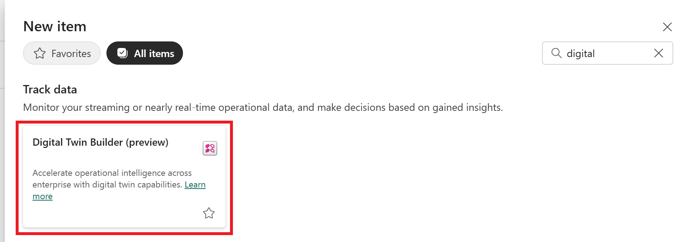

## Create new digital twin builder item in Fabric

1. Go to your Fabric workspace. 
2. Select **New item**.
3. Search for the *Digital Twin Builder (preview)* item, and select it.

    
    
4. Enter a name for your item and select **Create**. 

    > [!TIP]
    > Digital twin builder names can include numbers, letters, and underscores (no spaces or dashes).

5. Wait for your digital twin builder item to be created. This process might take several minutes.
6. Once your digital twin builder item is ready, it opens to the semantic canvas.