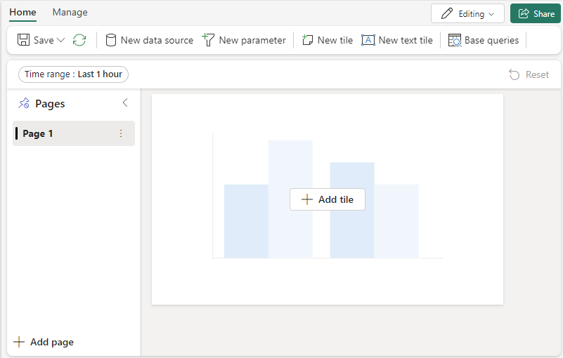

The Real-Time Dashboard exists within the context of a workspace. A new Real-Time dashboard is always associated with the workspace you're using when you create it.

1. Browse to the desired workspace.
1. Select **+ New item** and choose the **Real-Time Dashboard** item.
1. Enter a dashboard name and select **Create**.

A new dashboard is created in your workspace.