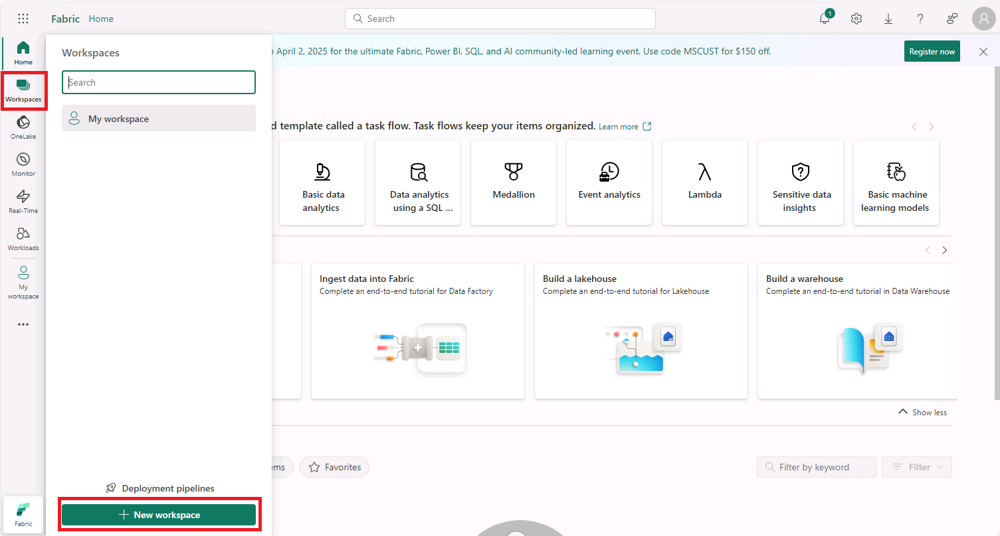
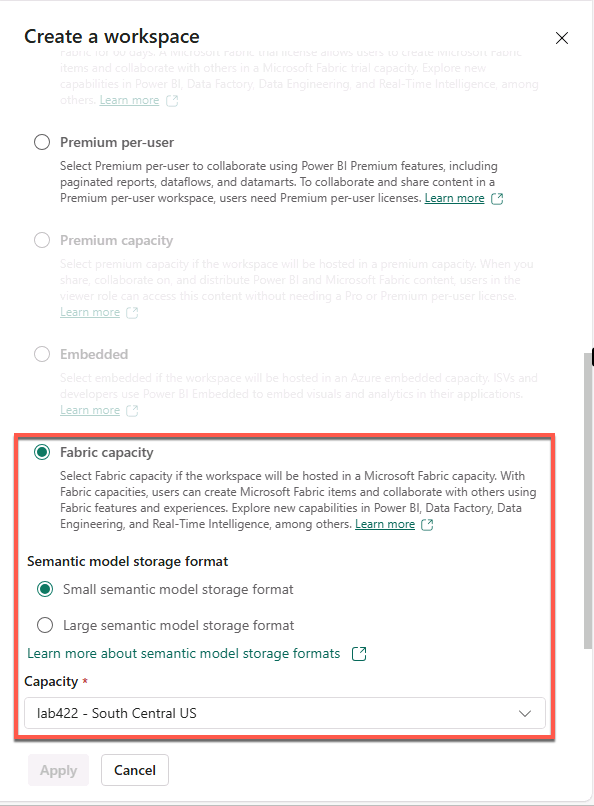
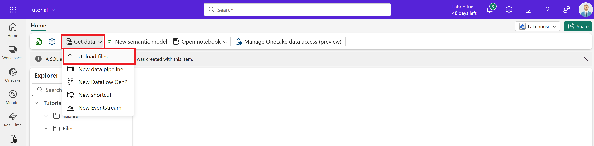
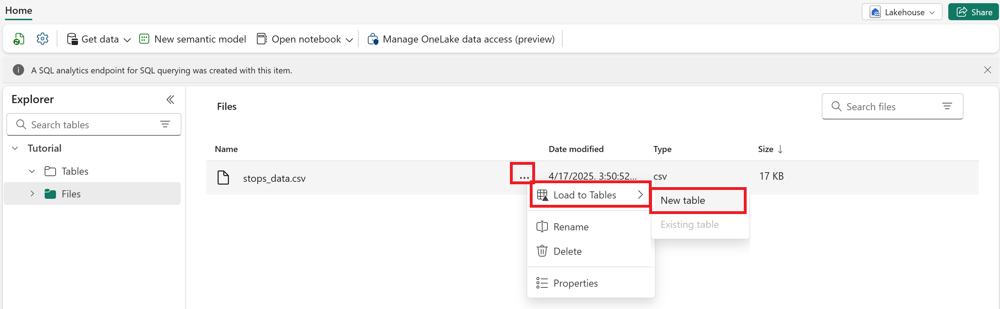
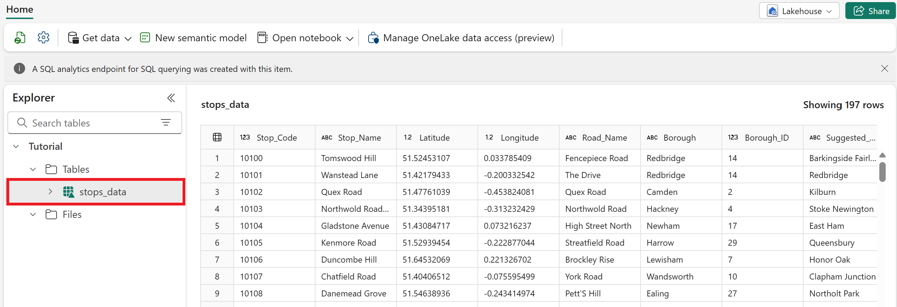

# Digital twin (preview) in Real-Time Intelligence lab part 1: Upload contextual data

In this part of the lab, you set up the sample data lakehouse and upload the static sample data: a CSV file of bus stop data that provides contextual information about stop locations.

## Create a workspace

1. In the virtual machine, open a web browser and browse to +++https://app.fabric.microsoft.com+++.
2. When prompted, sign in using the following credentials:
   - **Email**: +++@lab.CloudPortalCredential(User1).Username+++
   - **Password**: +++@lab.CloudPortalCredential(User1).Password+++

3. Select **Workspaces** from the left navigation pane. Then select **+ New workspace**.

    

4. Enter a name for the workspace, such as +++TutorialWorkspace+++. Expand the **Advanced** option and make sure **Fabric Capacity** is selected then select **Apply** when done.

     

## Create a lakehouse

1. Browse to the workspace in which you want to create your lab resources. You must create all resources in the same workspace.
2. Select **+ New item**.
3. In the **Filter by item type** search box, enter **Lakehouse**.
4. Select the lakehouse item.
5. Enter +++*Tutorial*+++ as the lakehouse name.
6. Select **Create**. When provisioning is complete, the lakehouse explorer page is shown.

## Upload static contextual data

In this section, you upload a static file of bus stop data to the *Tutorial* lakehouse. The information in this file provides context about the locations of the bus stops along the bus routes.

1. Download the *stops_data.csv* sample data file from the sample folder in GitHub: [digital-twin-builder-tutorial-bus](https://aka.ms/dtb-samples-bus).

2. In the lakehouse explorer page in Fabric, select **Get data** from the menu ribbon and choose **Upload files**.

    

3. Select the sample data file you downloaded and then select **Upload**. When the file is finished uploading, close the **Upload files** pane.

4. In the **Explorer pane** on the left, select **Files**. Hover over the file name and select the ... that appears. Then select **Load to Tables** and **New table**.

    

5. Name the table +++*stops_data*+++. Leave the other default settings and select **Load**.

6. When the table is created, review your new **stops_data** table and verify that it contains data.

    

## Next step

> Select **Next >** to Get streaming data into the lakehouse.
