# Digital twin builder (preview) in Real-Time Intelligence lab part 3: Build the ontology

In this part of the lab, you build a digital twin ontology that models the bus and bus stop data. You create a digital twin builder (preview) item, and define entities for the buses and stops. Then, you map the data from the *Tutorial* lakehouse to the entities, and define relationships between the entities to further contextualize the data.

[!INCLUDE [Fabric feature-preview-note](../lab/includes/feature-preview-note.md)]

<!--## Create new digital twin builder item in Fabric-->
[!INCLUDE [Real-Time Intelligence create-digital-twin-builder](../lab/includes/create-digital-twin-builder.md)]

In the semantic canvas, you can add entities and relationships to define an ontology.

## About entities and relationships

In digital twin builder (preview), an *entity* is a category that defines a concept within a domain-specific ontology. The entity definition serves as a blueprint for individual entity instances of that entity, and specifies common characteristics shared across all instances within that category. Here you define two entities for the sample scenario: Bus and Stop.

After defining entities, you can create *relationships* between them to define how they're related to each other. In this lab, a Bus *goesTo* a Stop.

## Add Bus entity

First, create a new entity for the bus.
1. In the semantic canvas of digital twin builder (preview), select **Add entity**.

    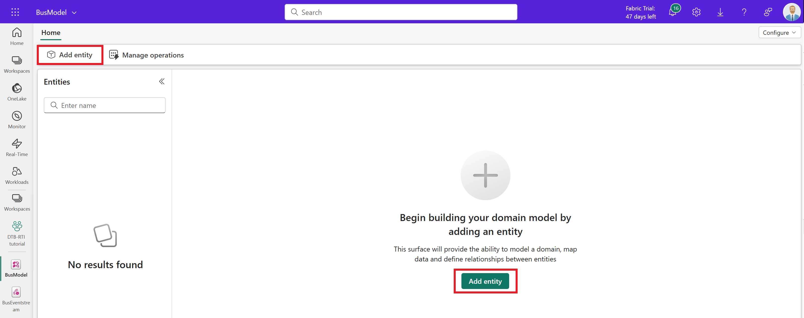

2. Leave the *Generic* system type selected, and enter +++*Bus*+++ for the entity name. Select **Add entity**.
3. The *Bus* entity is created and becomes visible on the canvas.

    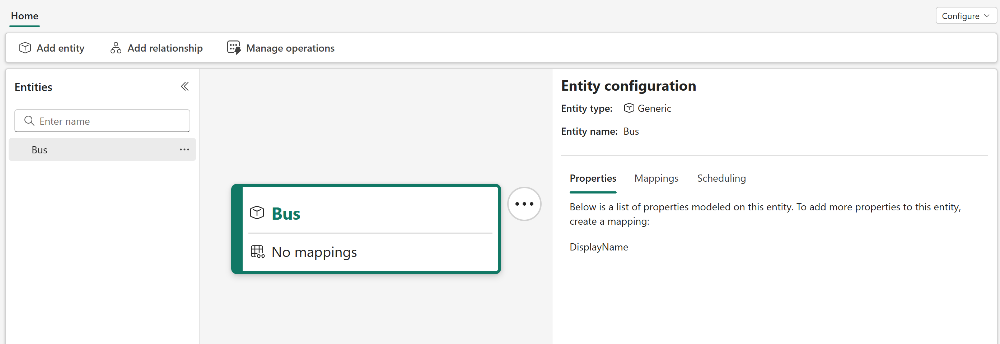

### Map non-timeseries bus data

Next, map some non-timeseries data to the Bus entity. These fields are static properties that identify a bus and its visit to a certain stop.
1. In the **Entity configuration** panel, switch to the **Mappings** tab and select **Add data**.

    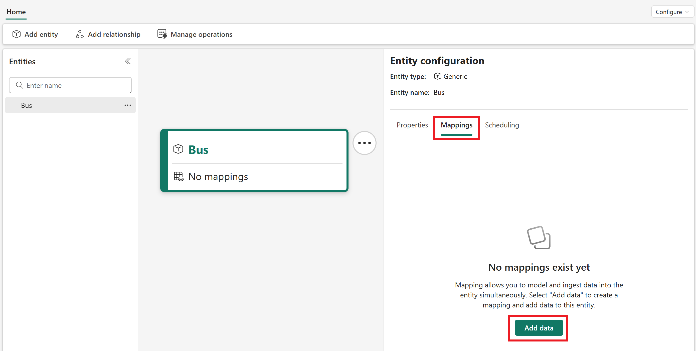

2. Open **Select lakehouse table** to select a data source for your mapping. Select your tutorial workspace, the *Tutorial* lakehouse, and the *bus_data_processed* table.

    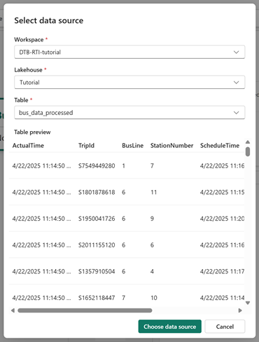      

    You can wait for the data preview to load if you want, but you don't have to. Select **Choose data source** to confirm.

3. For the **Property type**, leave the default selection of **Non-timeseries properties**. 
4. Under **Unique Id**, select the edit icon (shaped like a pencil) to choose a unique ID out of one or more columns from your source data. Digital twin builder uses this field to uniquely identify each row of ingested data.

    Select *TripId* as the unique ID column.

    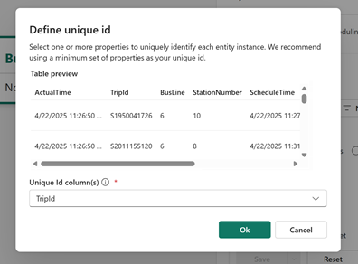

5. Under **Mapped properties**, select the edit icon to choose which properties from your source data to map to the bus entity.

    The **Map properties** page lets you select a column from your source data on the left side, and map it to a new property on your entity on the right side. By default, selecting a column name from the source data on the left side fills in the right side automatically with a matching name for the entity property, but you can enter a new name for the property on the right side if you want the entity property to be named something different than what it's called in the source data.

    The page loads with a *DisplayName* property for the entity, which is unmapped to any column in the source data. Leave the *DisplayName* property unmapped as it is, and select **Add entity property** to add new properties to the mapping.

    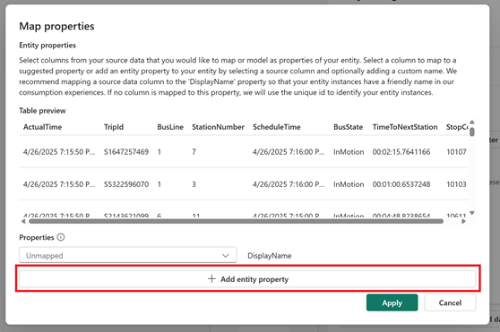

    Map the following entity properties:
    - Select **TripId** from the dropdown menu in the left column, and edit the box across from it in the right column to read *TripId_static*. This action creates a property on the bus entity named *TripId_static*, which gets its value from the **TripId** property in the source data.
    - Select **StopCode** from the dropdown menu in the left column, and edit the box across from it in the right column to read *StopCode_static*. This action creates a property on the bus entity named *StopCode_static*, which gets its value from the **StopCode** property in the source data.
    
    Check the box to acknowledge that properties can't be renamed or removed, and select **Apply**.

    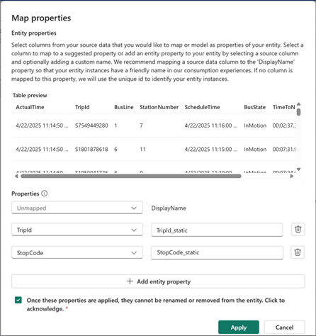

6. **Save** the mapping.

    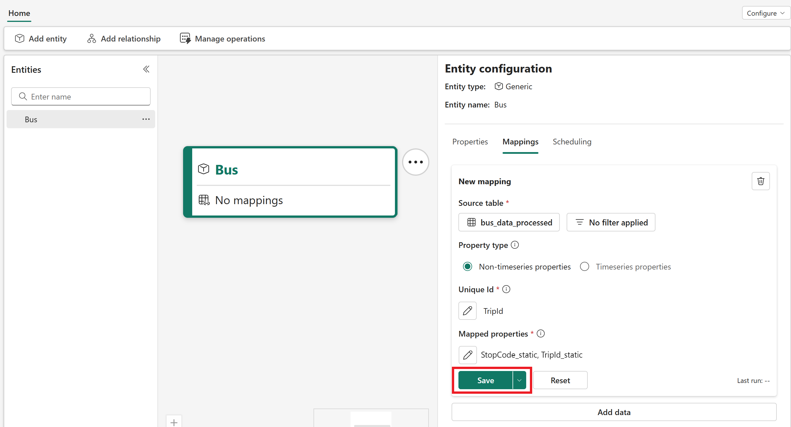

7. Switch to the **Scheduling** tab and select **Run now** to apply the mapping.

    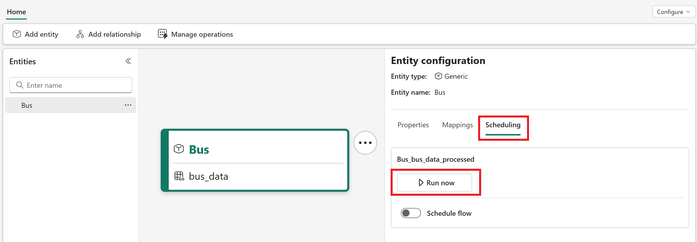

### Map time series bus data

Next, map some time series data to the Bus entity. These properties are streamed into the data source from the Eventstream sample data, and they contain information about the bus's location and movements.

1. Switch back to the **Mappings** tab for the Bus entity and select **Add data** to add a new mapping.

    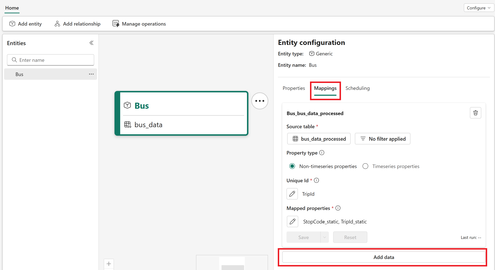

2. Open **Select lakehouse table** to select a data source for your mapping. Again, select your tutorial workspace, the *Tutorial* lakehouse, and the *bus_data_processed* table. Select **Choose data source**.
3. This time, switch the **Property type** to **Timeseries properties**.
4. Under **Mapped Properties**, select the edit icon.

    The page loads with a *Timestamp* property for the entity, which is unmapped to any column in the source data. *Timestamp* requires a mapping, so select **ActualTime** from the corresponding dropdown menu on the left side. Then, select **Add entity property** to add new properties to the mapping.

    Map the following properties. When you select these property names from the source columns on the left side, leave the default matching names that populate on the right side.
    - ScheduleTime
    - BusLine
    - StationNumber
    - StopCode
    - BusState
    - TimeToNextStation
    - TripId

    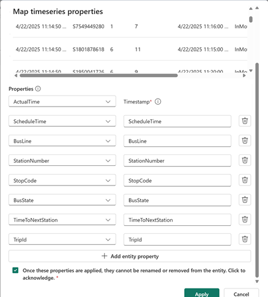

5. Check the box to acknowledge that properties can't be renamed or removed, and select **Apply**.
6. Next, link your time series data to this entity. This process requires you to select both an entity property and a column from your time series data table. The column selected from the time series data must **exactly** match data that is mapped to the selected entity property. This process ensures correct contextualization of your entity and time series data. 

    Under **Link with entity property**, select the edit icon. 

    For **Choose entity property,** select *TripId_Static* from the dropdown menu. For **Select column from timeseries data...**, select *TripId*. Select **Apply**.

7. Make sure **Incremental mapping** is enabled and **Save** the mapping. Confirm when prompted.

    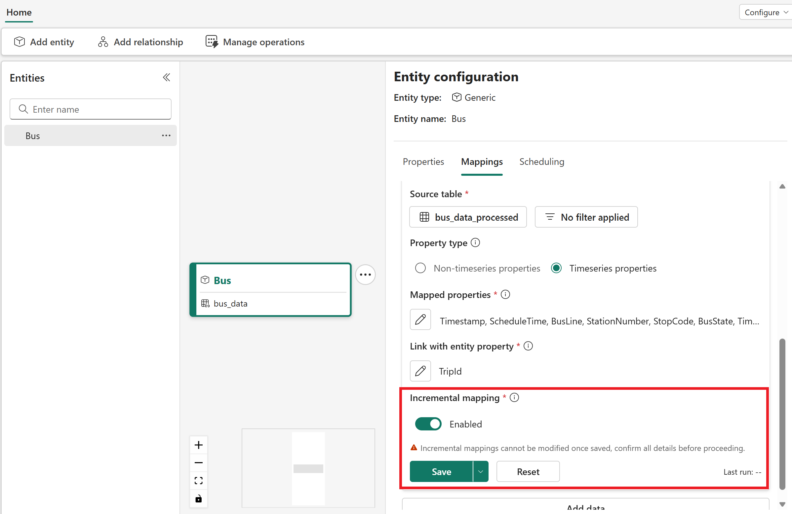

8. Switch to the **Scheduling** tab and select **Run now** under the new time series mapping to apply it.

## Add Stop entity

Next, create a second entity to represent a bus stop.
1. In the semantic canvas, select **Add entity**.
2. Leave the *Generic* system type selected, and enter *Stop* for the entity name. Select **Add entity**.
3. After a few minutes, the *Stop* entity is now visible on the canvas.

    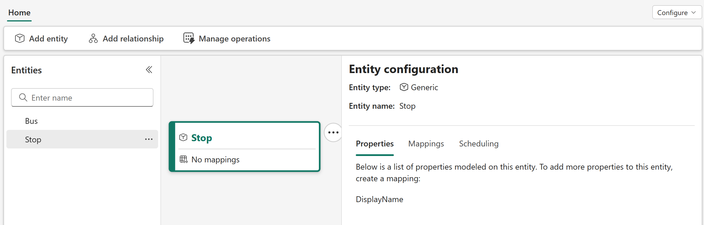

### Map non-timeseries stop data

Next, map some non-timeseries data to the Stop entity. The stop data doesn't contain any time series data, only static data about the bus stops and their locations. Later, when you link the Stop and Bus entities together, this data is used to enrich the bus fact data with dimensional data.

1. In the **Entity configuration** panel, open the **Mappings** tab and select **Add data**.
2. Open **Select lakehouse table** to select a data source for your mapping. Select your tutorial workspace, the *Tutorial* lakehouse, and the *stops_data* table.

    Select **Choose data source**.
3. For the **Property type**, leave the default selection of **Non-timeseries properties**. 
4. For the **Unique Id**, select *Stop_Code*.
5. For **Mapped properties**, map **Stop_Name** from the source data to the *DisplayName* property on the right side.

    Then, add the following new properties to the mapping. When you select these property names from the source columns on the left side, leave the default matching names that populate on the right side.
    - Stop_Code
    - Road_Name
    - Borough
    - Borough_ID
    - Suggested_Locality
    - Locality_ID
    - Latitude
    - Longitude
    
    Check the box to acknowledge that properties can't be renamed or removed, and select **Apply**.

    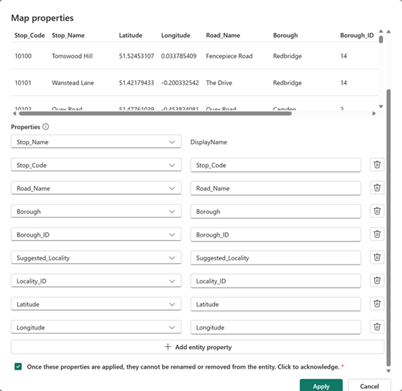

6. **Save** the mapping.

    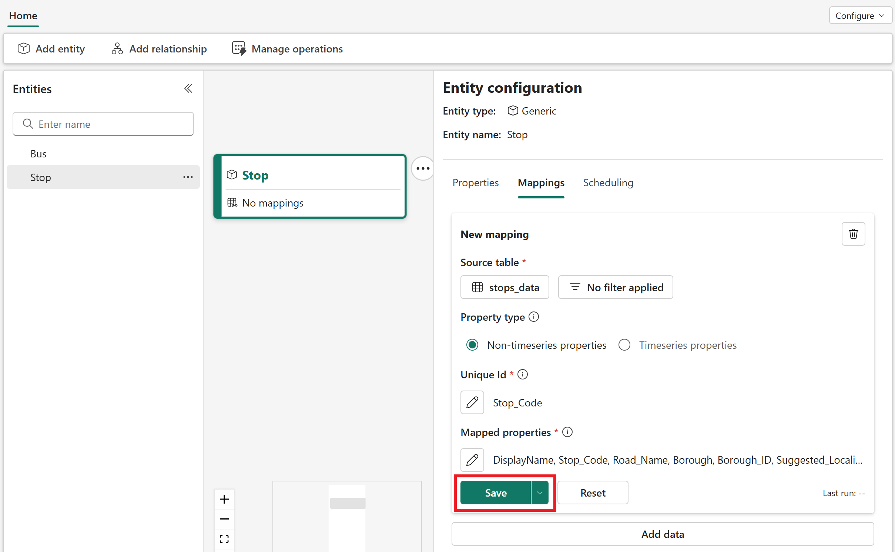

7. Switch to the **Scheduling** tab and select **Run now** to apply the mapping.

<!--### Create Borough entity-->

## Define relationship

Next, create a relationship to represent that a Bus *goesTo* a Stop.

1. In the semantic canvas, highlight the **Bus** entity and select **Add relationship**.

    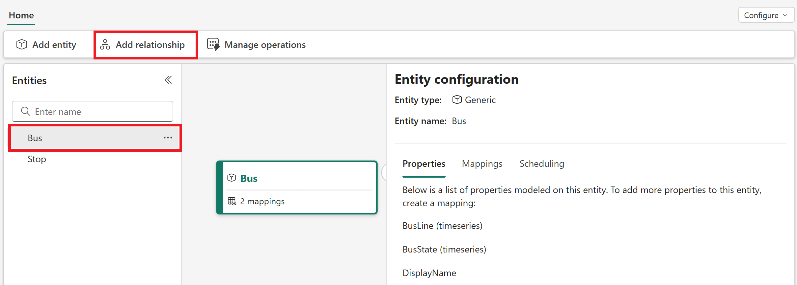

2. In the **Relationship configuration** panel, enter the following information:
    - **First entity**: Bus (filled automatically)
        - **Property to join**: StopCode_static
    - **Second entity**: Stop
        - **Property to join**: Stop_Code
    - **Relationship name**: Enter +++*goesTo*+++
    - **Select relationship type**: Many Stop per Bus (1:N)
    
    Select **Create**.

    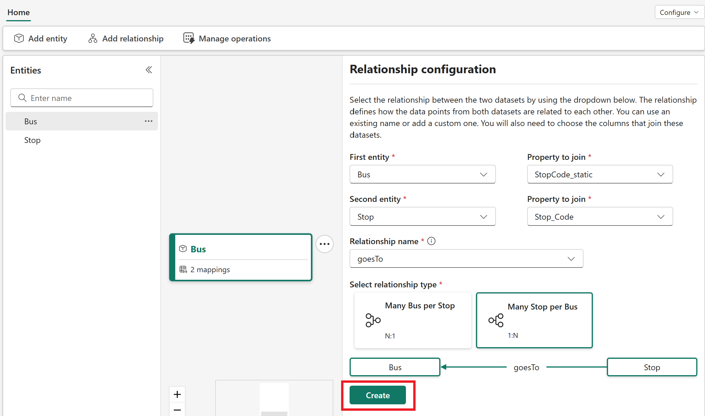

3. In the **Scheduling** section that appears, select **Run now** to apply the relationship.

Now your Bus and Stop entities are visible in the canvas with a relationship between them. Together, these elements form the ontology for the tutorial scenario.

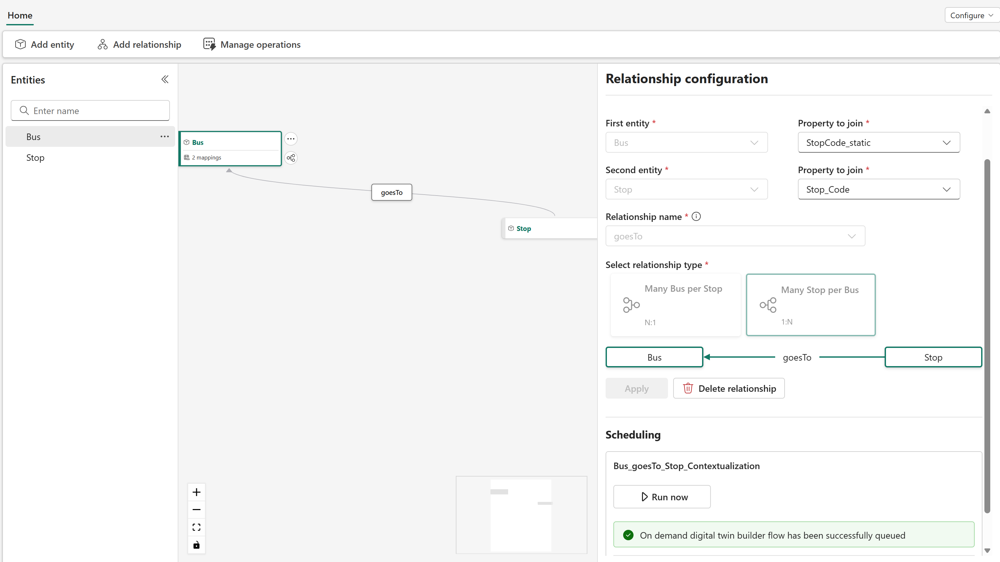

## Verify mapping completion

As a final step, confirm that all your data mappings ran successfully. 

1. From the menu ribbon, select **Manage operations**.

    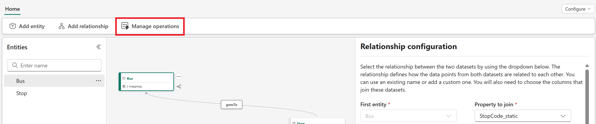

2. View the details of the mapping operations, and confirm that they all completed successfully.

    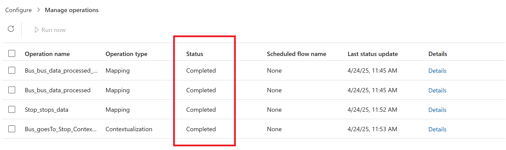

3. If any of the operations failed, check the box next to its name and select **Run now** to rerun it.

Wait for all mappings to complete before you move on to the next part of the lab. In the next part of the lab, you project the ontology you created to an eventhouse, to support further data analysis and visualization.

## Next step
> Select **Next >** to Project the ontology data to Eventhouse by using a Fabric notebook.

