# Digital twin builder (preview) in Real-Time Intelligence lab part 4: Project data to Eventhouse

In this section of the lab, you project your digital twin builder (preview) ontology into Eventhouse using [Fabric notebooks](../../data-engineering/how-to-use-notebook.md). This step makes it possible to run KQL queries on your digital twin builder data for further analysis in Real-Time Intelligence.

[!INCLUDE [Fabric feature-preview-note](../lab/includes/feature-preview-note.md)]

During this lab section, you create shortcuts to bring your digital twin builder data from the lakehouse where it's stored into your *Tutorial* KQL database in Eventhouse. Then, you run a notebook code sample that generates a script to project organized views of your digital twin builder data in Eventhouse. The script creates user-defined functions in Eventhouse, one for each entity and property type in your digital twin builder ontology. Later, you can use these functions in KQL queries to access your organized digital twin builder ontology data from Eventhouse.

## Prepare eventhouse KQL database

Start by preparing your eventhouse and KQL database to access digital twin builder (preview) data. 

Data from digital twin builder mappings is stored in a new lakehouse, with a name that looks like your digital twin builder item name followed by *dtdm*. The lakehouse is located in the root folder of your workspace. 

In this section, you add tables from your digital twin builder data lakehouse as external tables in the KQL database. Later, you run sample notebook code to set up an Eventhouse projection that runs on and organizes this data.

1. Go to the *Tutorial* KQL database that you created earlier in [Lab part 2: Get streaming data](tutorial-rti-2-get-streaming-data.md).
2. From the menu ribbon, select **New** > **OneLake shortcut**.

    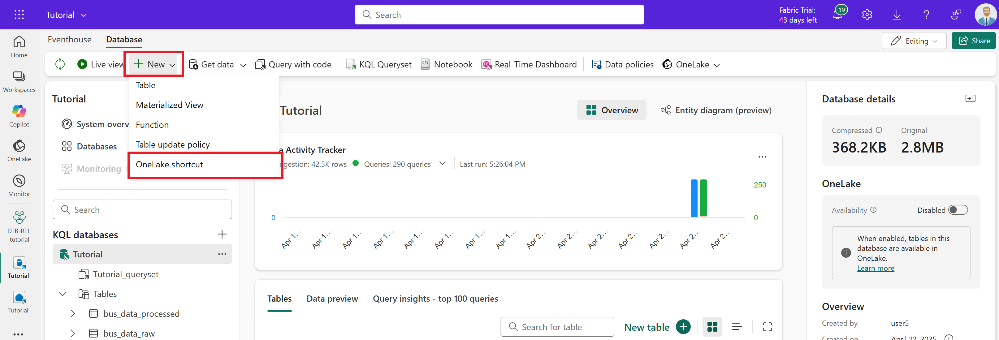

3. Under **Internal sources**, select **Microsoft OneLake**. Then, choose your digital twin builder data lakehouse (remember that the name looks like your digital twin builder item name followed by *dtdm*).
4. Expand the list of **Tables** and begin selecting all tables. There's a limit to the number of tables that you can add to a shortcut at once, so stop after you select 10 tables and see the warning message. Make a note of where you stopped.

    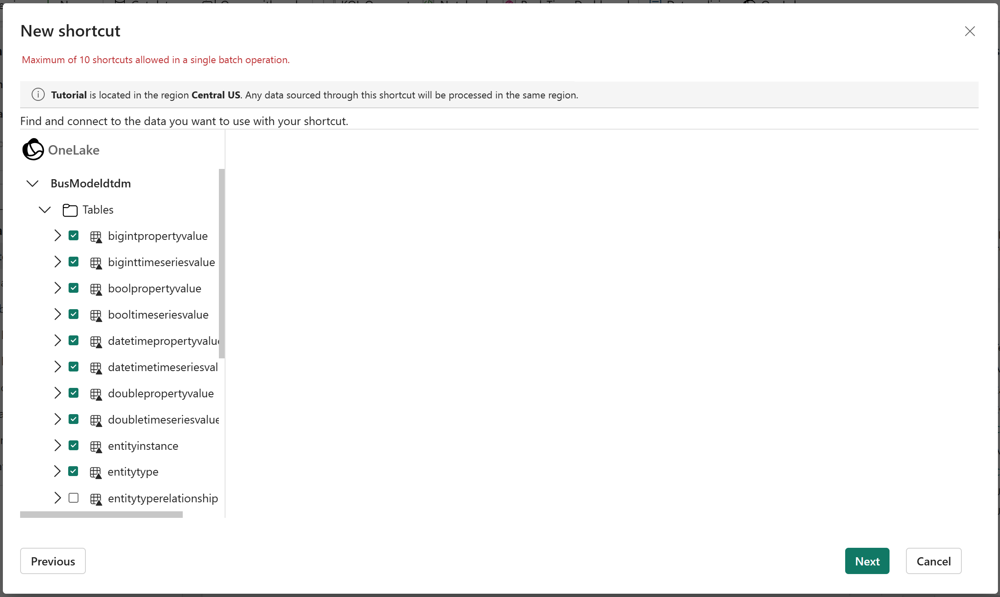

5. Select **Next** and **Create** to create the shortcuts.
6. Repeat steps 2-5 twice more until all tables are added as shortcuts.
7. When you're finished, you see all the external digital twin builder data tables under **Shortcuts** in the KQL database.

    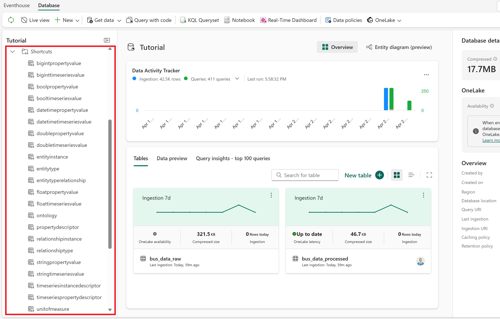

## Prepare notebook and install dependencies

Next, prepare a notebook to run the sample Eventhouse projection code on the digital twin builder data in the KQL database. In this step, you create a new notebook linked to your digital twin builder data, copy in the sample notebook code, and install the required Python package.

### Create the notebook

First, prepare a Fabric notebook with the sample code to generate the Eventhouse projection.

1. Download [DTB_Generate_Eventhouse_Projection.ipynb](https://github.com/microsoft/fabric-samples/tree/main/docs-samples/real-time-intelligence) from the sample folder in GitHub.
2. Go to your workspace, and open the digital twin builder data lakehouse (remember that the lakehouse is located in the root folder of your workspace, and the name looks like your digital twin builder item name followed by *dtdm*).

    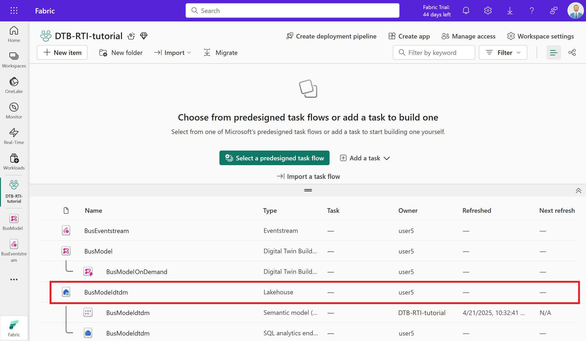

3. From the lakehouse, create a new notebook by selecting **Open notebook** > **New notebook**.

    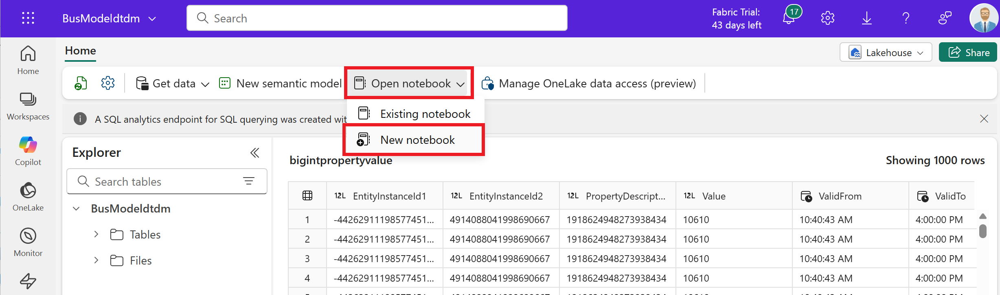

4. Copy the contents of the downloaded notebook file and paste them into your new notebook. We recommend separating the code sections into four code blocks like in the source file, for readability.

    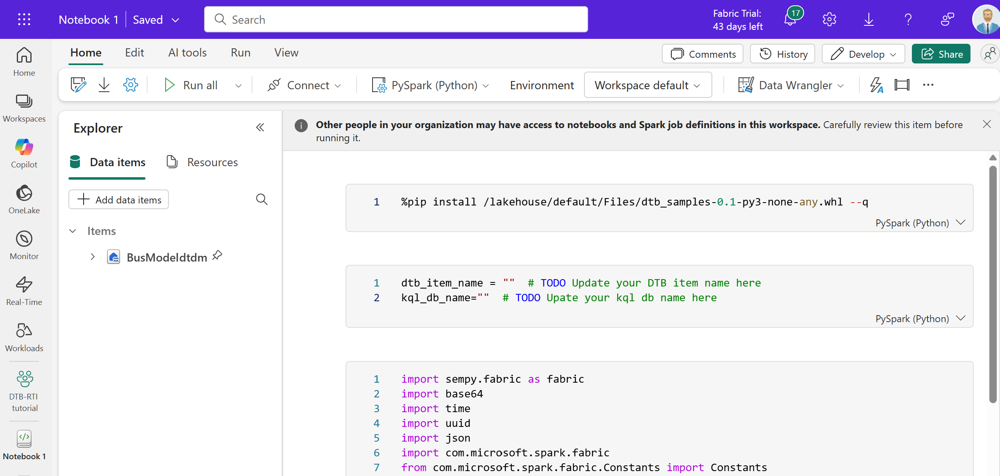

5. Save the notebook with the name +++*DTB_Generate_Eventhouse_Projection*+++.

> [!TIP]
> Alternatively, you can import the sample notebook directly into your Fabric workspace, as described in [How to use Microsoft Fabric notebooks](../../data-engineering/how-to-use-notebook.md#import-existing-notebooks). If you do it this way instead of creating a new notebook from the lakehouse ribbon, make sure that the digital twin builder data lakehouse is set as the default data item for the notebook.

### Upload and install the Python package 

Next, install the Python package that the notebook needs to work with digital twin builder data. In this section, you upload the package to your lakehouse and install it in the notebook.

1. Download [dtb_samples-0.1-py3-none-any.whl](https://github.com/microsoft/fabric-samples/tree/main/docs-samples/real-time-intelligence) from the sample folder in GitHub.
2. In the **Explorer** pane of your open notebook, expand the digital twin builder data lakehouse item. Select the three dots next to **Files**, and select **Upload** > **Upload files**.

    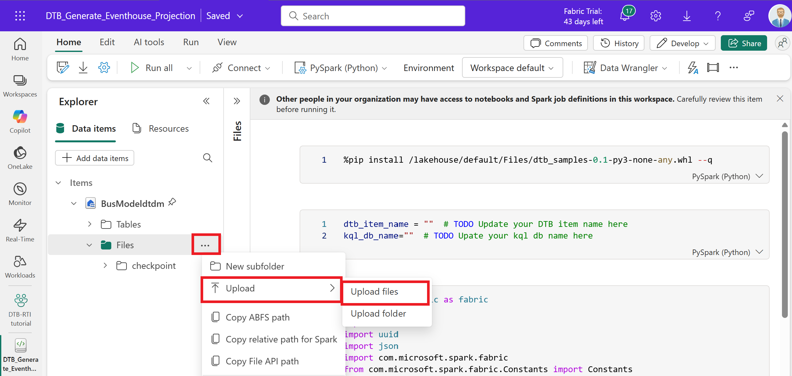

3. Upload the *.whl* file that you downloaded.
4. Close the **Upload files** pane and observe the new file in the **Files** pane for the lakehouse.

    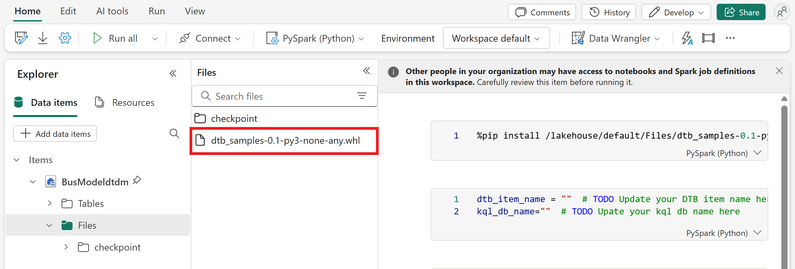

5. In the notebook, install the package by running the first code block.

    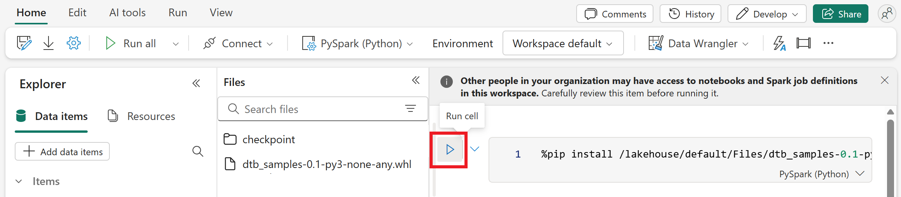

6. After less than a minute, the package is installed and the notebook confirms the successful run status with a checkmark underneath the code.

## Run Eventhouse projection code

Next, run the rest of the notebook code to generate the Eventhouse projection script. This script creates user-defined functions in Eventhouse that correspond to your digital twin builder entities and their properties.

1. In the second code block, there are variables for **dtb_item_name** and **kql_db_name**. Fill their values with the case-sensitive names of your digital twin builder item and *Tutorial* KQL database. Run the code block. The notebook confirms the successful run status with a checkmark underneath the code.

    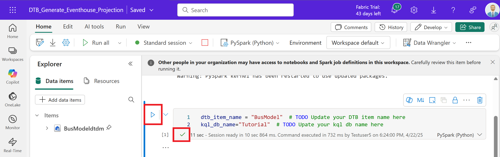

2. Scroll down to the next code block and run it. This code block completes the following operations:
    1. Connects to your **workspace** and your **digital twin builder ontology**
    1. Sets up a **Spark reader** to pull data from the digital twin builder database
    1. **Generates a script** that will push your digital twin builder data into Eventhouse
    1. Automatically creates several **functions** based on your digital twin builder's configuration, to make this data readily accessible in Eventhouse for use in KQL queries
3. The notebook confirms the successful run status with a checkmark underneath the code, and a list of functions that were added (one for each entity and property type).

    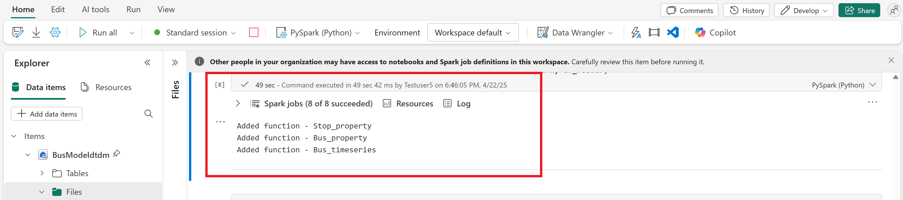

    > [!TIP]
    > If you see a *ModuleNotFoundError*, try rerunning the first code block with the package installation, and then rerun this code block.

4. Run the last code block. This runs a Python snippet that sends your script to the Fabric REST API and executes it against your KQL database. The notebook confirms the successful run status with a checkmark underneath the code, and confirmation that it successfully created the Eventhouse domain projection functions.

    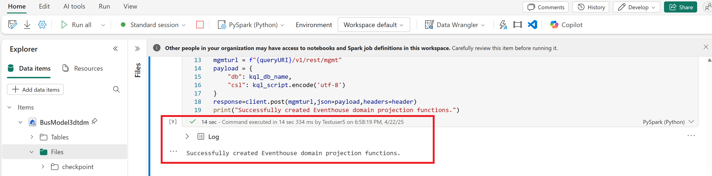

Now the projection functions are created in Eventhouse, one for each digital twin builder entity and its property types.

## Verify projection functions

Verify that the functions were created successfully in your KQL database.

1. Go to your *Tutorial* KQL database and refresh the view.
2. Expand **Functions** in the explorer panel to see a list of functions created by the notebook (the *extractBusData* function is also there from when you created it in [Lab part 2: Get streaming data](tutorial-rti-2-get-streaming-data.md)).

    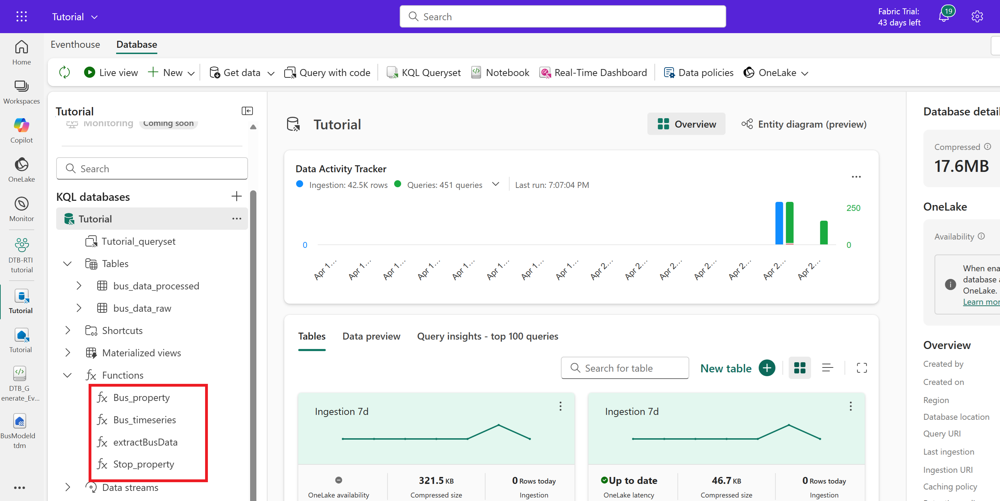

3. Select **Tutorial_queryset** from the explorer panel to open the query window. Use the **+** above the query pane to create a new query, and enter +++*.show functions*+++. This displays a list of functions in the queryset, which you can expand to see their details.

    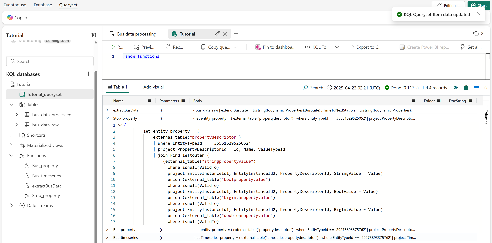

4. Run the functions to see the data projections they produce. Recognize that the properties correspond to the fields that you mapped to the digital twin builder ontology in [Tutorial part 3: Build the ontology](tutorial-rti-3-build-ontology.md).

    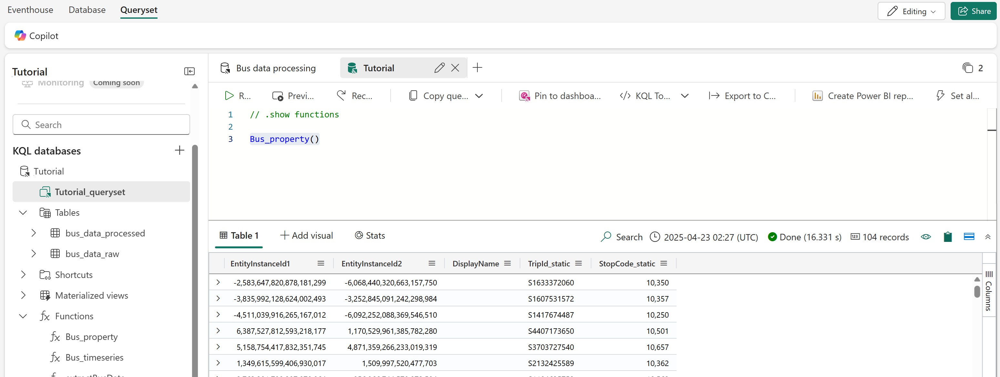

5. Optionally, save the query tab as *Explore functions* so you can identify it later.

Now you can write other KQL queries using these user-defined functions to access data from your digital twin builder (preview) ontology. In the next tutorial section, you use these functions to write KQL queries that extract insights from your data, and display the results in a Real-Time dashboard.

## Next step
> Select **Next >** to Query and visualize data.