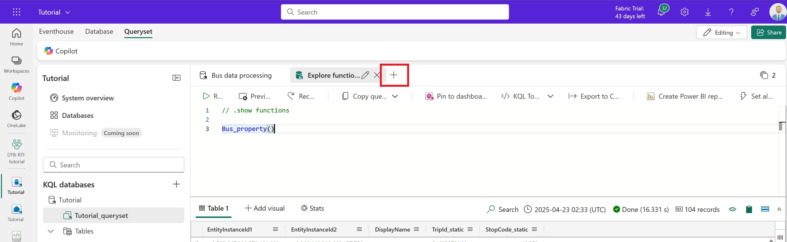
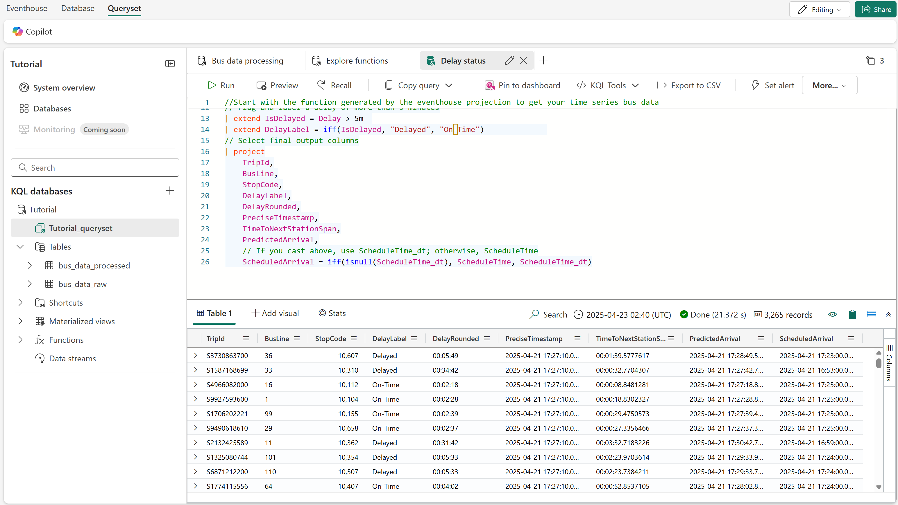
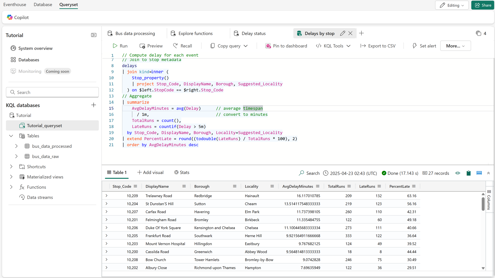
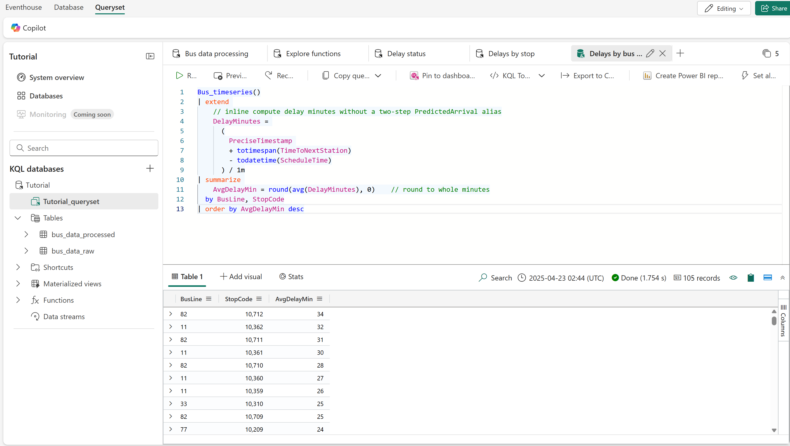
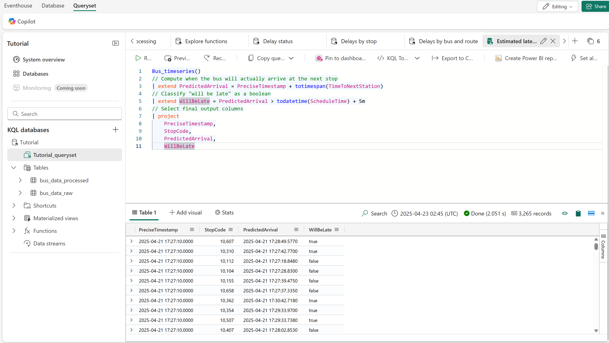
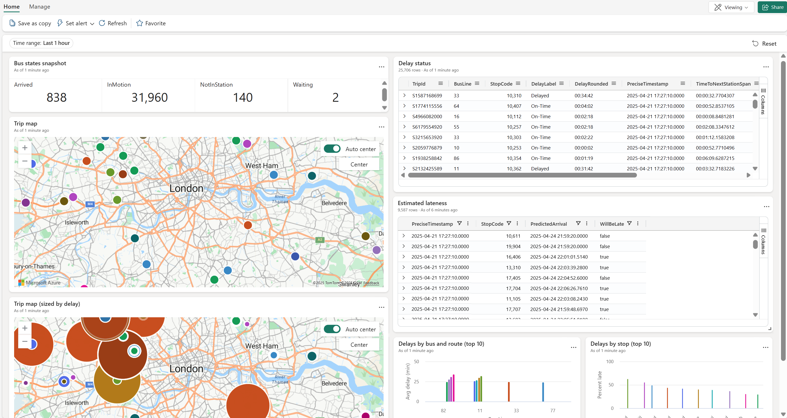
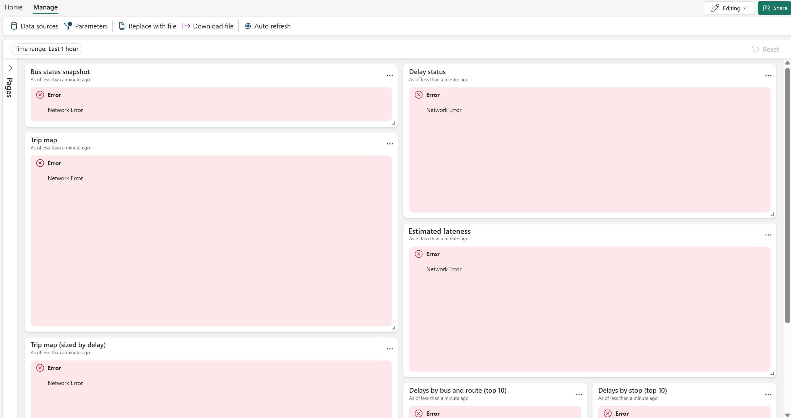
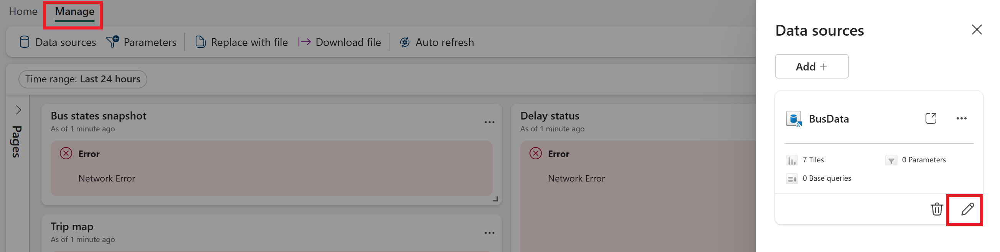
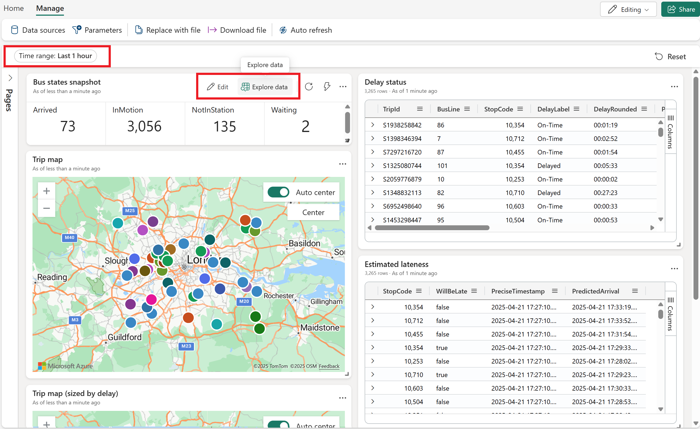

# Digital twin builder (preview) in Real-Time Intelligence lab part 5: Query and visualize data

Now that your digital twin builder (preview) data is projected to an eventhouse, you can examine it with a KQL queryset and visualize it with a Real-Time Dashboard. In this part of the lab, you set up a KQL (Kusto Query Language) queryset with sample queries to extract insights from the data, then visualize these insights with a Real-Time dashboard.

[!INCLUDE [Fabric feature-preview-note](../lab/includes/feature-preview-note.md)]

## Query the data using KQL

Begin in your *Tutorial_queryset* from the previous part of the lab. 

Using the **+** above the query pane, create the following new queries.



### Delay status

This query calculates the delay of each bus trip, by comparing the current time and the time to the next station with the scheduled arrival time.

```kusto
//Start with the function generated by the eventhouse projection to get your time series bus data
Bus_timeseries()
// Parse your travel‑time string into a timespan
| extend TimeToNextStationSpan = totimespan(TimeToNextStation)  
// If ScheduleTime is still text, cast it to real DateTime (drop this line if it's already a DateTime)
| extend ScheduleTime_dt = todatetime(ScheduleTime)      
// Compute when the bus will actually arrive
| extend PredictedArrival = PreciseTimestamp + TimeToNextStationSpan  
// Compare that prediction to the schedule
| extend Delay = PredictedArrival - iff(isnull(ScheduleTime_dt), ScheduleTime, ScheduleTime_dt)
| extend DelayRounded        = format_timespan(Delay, 'hh:mm:ss')
// Flag and label a delay of more than 5 minutes
| extend IsDelayed = Delay > 5m  
| extend DelayLabel = iff(IsDelayed, "Delayed", "On‑Time")              
// Select final output columns
| project
    TripId,
    BusLine,
    StopCode,
    DelayLabel,
    DelayRounded,
    PreciseTimestamp,
    TimeToNextStationSpan,
    PredictedArrival,
    // If you cast above, use ScheduleTime_dt; otherwise, ScheduleTime
    ScheduledArrival = iff(isnull(ScheduleTime_dt), ScheduleTime, ScheduleTime_dt)
```

Run the query and see the results.



### Delays by stop

This query calculates information about delays from a bus stop perspective, including the average delay time at the stop, and how often trips to the stop are late. 

```kusto
// Compute delay for each event
let delays = 
  Bus_timeseries()
  | extend TimeToNextStationSpan = totimespan(TimeToNextStation)
  | extend PredictedArrival = PreciseTimestamp + TimeToNextStationSpan
  | extend Delay = PredictedArrival - todatetime(ScheduleTime);
// Join to Stop metadata
delays
| join kind=inner (
    Stop_property()
    | project Stop_Code, DisplayName, Borough, Suggested_Locality
  ) on $left.StopCode == $right.Stop_Code
// Aggregate
| summarize
    AvgDelayMinutes = avg(Delay)      // average timespan
      / 1m,                           // convert to minutes
    TotalRuns = count(),
    LateRuns = countif(Delay > 5m)
  by Stop_Code, DisplayName, Borough, Locality=Suggested_Locality
| extend PercentLate = round((todouble(LateRuns) / TotalRuns * 100), 2)
| order by AvgDelayMinutes desc
```

Run the query and see the results.



### Delays by bus and route

This query calculates information about delays from a bus route perspective, computing an average delay for each combination of bus line and stop code.

```kusto
Bus_timeseries()
| extend 
    // inline compute delay minutes without a two‑step PredictedArrival alias
    DelayMinutes = 
      (
        PreciseTimestamp 
        + totimespan(TimeToNextStation)
        - todatetime(ScheduleTime)
      ) / 1m
| summarize 
    AvgDelayMin = round(avg(DelayMinutes), 0)    // round to whole minutes
  by BusLine, StopCode
| order by AvgDelayMin desc
```

Run the query and see the results.



### Estimated lateness

This query predicts whether a bus will be late at the next stop, based on the current time and the time to the next station.

```kusto
Bus_timeseries()
// Compute when the bus will actually arrive at the next stop
| extend PredictedArrival = PreciseTimestamp + totimespan(TimeToNextStation)
// Classify "will be late" as a boolean
| extend WillBeLate = PredictedArrival > todatetime(ScheduleTime) + 5m
// Select final output columns
| project
    PreciseTimestamp,
    StopCode,
    PredictedArrival,
    WillBeLate
```

Run the query and see the results.



## Visualize the data in a Real-Time dashboard

Now that you have some KQL queries to extract insights from your digital twin builder (preview) data, you can visualize the results of those queries in a Real-Time dashboard.

In this section, you use a template file to populate a Real-Time dashboard with data from the queries you created in the previous section, along with a few extra queries.

Here's what the dashboard looks like (notice the queries from the previous section: *Delay status*, *Delays by stop*, *Delays by bus and route*, and *Estimated lateness*):



### Create a new dashboard

Start by creating an empty Real-Time dashboard in your Fabric workspace.

[!INCLUDE [Real-Time Intelligence create-real-time-dashboard](../lab/includes/create-real-time-dashboard.md)]

### Upload template and connect data source

Next, use a template file to populate your dashboard with tiles based on your KQL queries from earlier.

<!--Update sample link when new content is available-->
1. Download the *DTB+RTI_dashboard.json* dashboard template from the sample folder in GitHub: [digital-twin-builder/bus-scenario](https://aka.ms/dtb-samples-bus).
2. In your Real-Time dashboard, select the **Manage** tab and **Replace with file**.
3. Open the dashboard template file that you downloaded. Continue through the **migration warnings** that flag the template's placeholder values for the database and workspace ID.
4. The template file populates the dashboard with multiple tiles, although the tiles can't get data because there's no connected data source yet.

    

6. From the **Manage** tab, select **Data sources**. This action opens the **Data sources** pane with a sample source for your data. Select the pencil icon to edit the BusData data source.

    

7. Under **Database**, select the dropdown arrow and **Eventhouse / KQL Database**. Select the *Tutorial* KQL database and select **Connect**. Select **Apply**, and close the **Data sources** pane.

After a few minutes, the visuals populate with data from your database.

> [!TIP]
> The dashboard keeps the current time in UTC, so the time range selector might not match your local time. If you don't see data, expand the time range. 

Take some time to explore the dashboard. You can use the **Edit** and **Explore data** icons on each tile to view the underlying queries, experiment with changing the time range filters and other tile options, and try adding your own new queries and tiles.



With this visualization, the end-to-end lab for using digital twin builder (preview) with Real-Time Intelligence is complete. You used digital twin builder to contextualize sample bus data streamed from Real-Time Intelligence, then projected your ontology data to Eventhouse to enable further insights through KQL queries and a Real-Time dashboard.

## Next step
> Select **Next >** to Clean up your resources.
