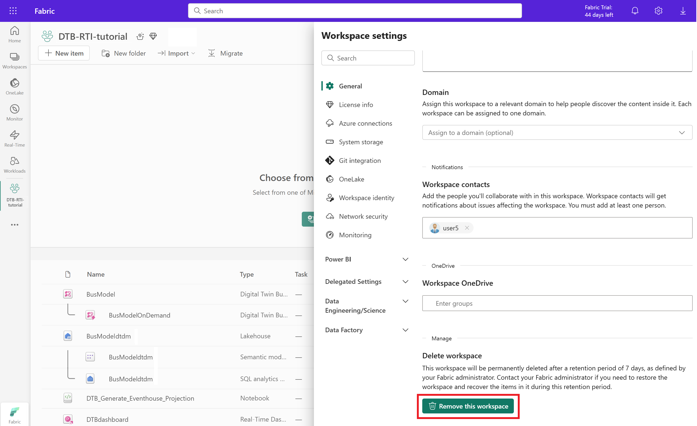

# Digital twin builder (preview) in Real-Time Intelligence lab part 6: Clean up resources

Once you finish the lab, you might want to delete all resources you created. 

[!INCLUDE [Fabric feature-preview-note](../lab/includes/feature-preview-note.md)]

To delete the data from this lab, follow these steps:
1. Delete your Fabric workspace, which also removes everything inside it, including:
    * the sample data lakehouse 
    * the eventhouse with the KQL database
    * the eventstream
    * the digital twin builder (preview) item
        * the associated lakehouse with all of its mapping and relationship data
    * the Fabric notebook
    * the Real-Time dashboard

    

2. Remove the sample data files you downloaded to your machine, including *stops_data.csv*, *dashboard-DTBdashboard.json*, *DTB_Generate_Eventhouse_Projection.ipynb*, and *dtb_samples-0.1-py3-none-any.whl*.
